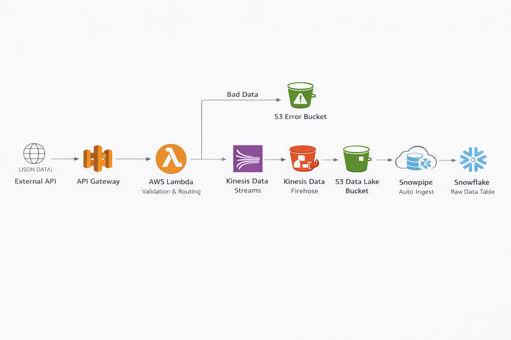

# Real-Time Data Streaming Pipeline (AWS → Snowflake)

A production-style, real-time data ingestion pipeline built using AWS managed streaming services and Snowflake, with an emphasis on data validation, fault isolation, and automated ingestion.

---

## Table of Contents

- [Overview](#overview)
- [Architecture](#architecture)
- [End-to-End Data Flow](#end-to-end-data-flow)
- [Data Validation & Error Handling](#data-validation--error-handling)
- [Streaming & Delivery Design](#streaming--delivery-design)
- [Snowflake Ingestion (Snowpipe)](#snowflake-ingestion-snowpipe)
- [Testing & Verification](#testing--verification)
- [Security & IAM Considerations](#security--iam-considerations)
- [Cost Management & Teardown](#cost-management--teardown)
- [Future Improvements](#future-improvements)
- [Key Takeaways](#key-takeaways)

---

## Overview

This project demonstrates the design and implementation of a **real-time data ingestion pipeline** using AWS and Snowflake.

The primary goals of the pipeline were to:

- Ingest JSON data from an external API
- Validate incoming data before it enters the streaming layer
- Isolate malformed or invalid records
- Deliver clean, validated data to Snowflake with minimal latency
- Preserve raw data for downstream analytics and transformation

Rather than focusing only on moving data from point A to point B, this project emphasizes **production-grade concerns** such as data quality, failure isolation, automation, and cost control.

---

## Architecture

**High-level architecture:**

External Client
↓
API Gateway
↓
Lambda (Validation)
├── Invalid Data → S3 Error Bucket
↓
Kinesis Data Streams
↓
Kinesis Data Firehose
↓
S3 Landing Bucket
↓
Snowpipe (Auto-Ingest)
↓
Snowflake Raw Table

This design ensures that **only validated data** enters the streaming system and downstream analytics environment.

---

## End-to-End Data Flow

1. An external client sends a JSON payload via an HTTP POST request.
2. **API Gateway** receives the request and forwards it to AWS Lambda using a proxy integration.
3. **Lambda** parses and validates the payload:
   - If the payload is malformed or missing required fields, it is written to an **S3 error bucket**.
   - If valid, the record is published to **Kinesis Data Streams**.
4. **Kinesis Data Firehose** buffers streaming records and writes JSON files to an S3 landing bucket.
5. **Snowpipe** automatically detects new files and ingests them into a raw table in Snowflake.

---

## Data Validation & Error Handling

Data validation occurs **before** the data enters the streaming layer.

### Validation Rules

- Payload must be valid JSON
- Required `id` field must be present and non-null

### Failure Handling Strategy

- Invalid or malformed records are written directly to a dedicated **S3 error bucket**
- Invalid data is prevented from entering Kinesis, Firehose, and Snowflake

This approach prevents:
- Stream pollution
- Downstream ingestion failures
- Corruption of analytics tables

---

## Streaming & Delivery Design

### Kinesis Data Streams

- Serves as the real-time ingestion backbone
- Default shard configuration used for simplicity

### Kinesis Data Firehose

- **Source:** Kinesis Data Streams
- **Destination:** S3 landing bucket
- **Buffer size:** 1 MiB
- **Buffer interval:** 5 seconds
- **File format:** JSON (`.json`)

These settings prioritize **low-latency delivery** while still producing file sizes suitable for efficient downstream ingestion.
The buffer size and buffer interval were only so small for the sake of this project. In production, unless otherwise required by the business needs, I would increase both the buffer size and 
the buffer interval in order to minimize the number of writes to S3 and increase the size of each file while also reducing the number of files overall.
This would result in more efficient operation, making the pipeline both faster and cheaper to run.

---

## Snowflake Ingestion (Snowpipe)

Snowflake ingestion is fully automated using **Snowpipe with auto-ingest enabled**.

### Components

- S3 storage integration with IAM role trust relationship
- External stage pointing to the S3 landing bucket
- Raw table designed to store JSON payloads as received
- SQS notifications trigger Snowpipe upon file arrival

This event-driven ingestion pattern eliminates the need for scheduled batch jobs and reduces operational overhead.

---

## Testing & Verification

Testing was performed using **Postman** to validate both success and failure scenarios.

### Valid Data Test

- Sent JSON payload containing all required fields
- Verified:
  - File creation in the S3 landing bucket
  - Successful ingestion into the Snowflake raw table

### Invalid Data Test

- Sent JSON payload with a missing `id` field
- Verified:
  - Record written to the S3 error bucket
  - No ingestion into Snowflake

These tests confirmed correct behavior for both **happy-path ingestion** and **error isolation**.

---

## Security & IAM Considerations

IAM roles were created for:

- API Gateway and Lambda execution
- Snowflake access to S3 via a storage integration

While permissions were intentionally broad during development, this project demonstrates:

- Cross-account IAM trust relationships
- Use of external IDs for Snowflake integrations
- Separation of ingestion and error-handling resources

---

## Cost Management & Teardown

After validating the pipeline end-to-end, all AWS resources were **intentionally shut down** to avoid unnecessary cloud costs.

The project is preserved through:
- Architecture diagrams
- Configuration artifacts
- Screenshots of deployed resources

This reflects real-world engineering practices where **infrastructure lifecycle management** is a core responsibility.

---

## Future Improvements

- Introduce a schema registry for stricter validation
- Add dead-letter queues for error handling
- Implement CloudWatch metrics and alerts
- Define infrastructure using Terraform
- Add CI/CD for automated deployment

---

## Key Takeaways

- Data validation is most effective **before** streaming, not after
- Isolating bad data simplifies downstream systems
- Event-driven ingestion reduces operational complexity
- Cost awareness is an essential part of data engineering
